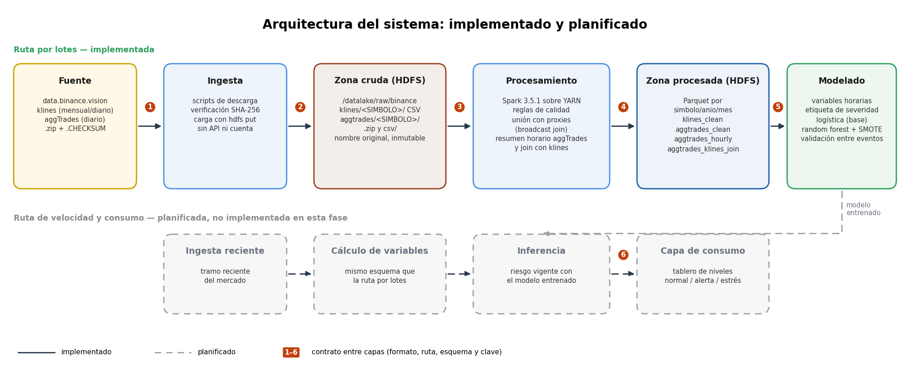

# Deteccion temprana de perdida de paridad en stablecoins

Proyecto del curso **Big Data y Analitica de Datos** (UPAO, NRC 9770). Se procesan velas (klines) y operaciones agregadas (aggTrades) de Binance sobre un cluster Hadoop/YARN/Spark para detectar de forma temprana la perdida de paridad (depeg) de stablecoins en tres eventos: **Terra/UST (mayo 2022)**, **FTX (noviembre 2022)** y **SVB (marzo 2023)**.

## 1. Requisitos

| Componente | Version |
|---|---|
| Java | 17 |
| Hadoop (HDFS + YARN) | 3.3.6 |
| Spark | 3.5.1 |
| Python | 3.11 |

Librerias de Python: `pip install -r requirements.txt`

## 2. Cluster

- Master: VM Debian (2 vCPU, ~3.8 GiB RAM) con NameNode, ResourceManager y DataNode.
- Worker adicional en WSL2 (cuando se usa el cluster completo).
- Spark en modo local (`--master 'local[*]' --driver-memory 2g`) o YARN client (`--master yarn --deploy-mode client`).
- Zona horaria de sesion de Spark: UTC. Particiones de shuffle: 8.

## 3. Estructura de carpetas

```
scripts/        descarga y carga de datos (download_klines.py, download_aggtrades.py, upload_aggtrades.sh)
src/            jobs de Spark (quality.py, quality_opt.py, benchmark_join.py, ingest_aggtrades.py, aggtrades_hourly.py)
notebooks/      01_ingesta, 02_calidad_datos, 03_eda, 04_features, 05_modelo_baseline, 05_modelo_definitivo, 06_benchmarks
benchmarks/     resultados de benchmarks (resultados/pedido5, escalabilidad, aggtrades)
./              scripts de benchmark (run_pedido5.sh, bench_scale.sh, bench_local.sh, bench_opt.sh, bench_join.sh)
aportes/        aportes individuales (aportes/adriel: verificacion de calidad de klines_clean)
informe/        figuras del informe
data/sample/    muestras reales (100 filas por simbolo)
data/           klines_clean y features.parquet usados por los notebooks
```

## 4. Arquitectura del sistema


## 5. Orden de ejecucion

### 5.1 Descargar klines
```bash
python3 scripts/download_klines.py
# opciones: --solo-proxy  --solo-proxy-svb  --solo-proxy-btc  --solo-proxy-btc-svb  --solo-marzo
```
Los .zip se descargan a `zona_cruda/` y se extraen con `unzip`.

### 5.2 Cargar klines a HDFS
```bash
hdfs dfs -mkdir -p /datalake/raw/binance/klines
hdfs dfs -put -f zona_cruda/klines/* /datalake/raw/binance/klines/
```

### 5.3 Calidad y limpieza de klines
```bash
spark-submit --master yarn --deploy-mode client src/quality.py \
  --input hdfs:///datalake/raw/binance/klines \
  --output hdfs:///datalake/processed/binance/klines_clean
```
`src/quality_opt.py` es la version optimizada (ver encabezado del script).

### 5.4 Benchmarks de join y escalabilidad
```bash
spark-submit src/benchmark_join.py
bash run_pedido5.sh
bash bench_scale.sh <E>
bash bench_local.sh <orig|opt> <10|100|150|200>
```
Resultados en `benchmarks/resultados/`.

### 5.5 aggTrades de las ventanas de eventos
```bash
python3 scripts/download_aggtrades.py      # descarga, verifica SHA-256 y extrae
bash scripts/upload_aggtrades.sh           # sube a HDFS
spark-submit --master 'local[*]' --driver-memory 2g src/ingest_aggtrades.py
spark-submit --master 'local[*]' --driver-memory 2g src/aggtrades_hourly.py
```

### 5.6 Notebooks (en este orden)
`notebooks/01_ingesta` -> `02_calidad_datos` -> `03_eda` -> `04_features` -> `05_modelo_baseline` -> `05_modelo_definitivo` -> `06_benchmarks`.
Leen `data/klines_clean/` y `data/features.parquet`.

### 5.7 Verificacion de calidad (sin cluster)
```bash
python aportes/adriel/verificar_calidad.py
```
Revisa `data/klines_clean/` con pandas (esquema, nulos, duplicados, OHLC, huecos, particiones, proxy) y deja resultados en `aportes/adriel/resultados/`. Hallazgos en `aportes/adriel/reporte_verificacion.md`.

### 5.8 Informe
Las figuras del informe estan en `informe/`.

## 6. Rutas en HDFS

```
/datalake/raw/binance/klines/<SIMBOLO>/
/datalake/raw/binance/aggtrades/<SIMBOLO>/*.zip   y   .../csv/*.csv
/datalake/processed/binance/klines_clean
/datalake/processed/binance/aggtrades_clean       (particionado simbolo/anio/mes)
/datalake/processed/binance/aggtrades_hourly
/datalake/processed/binance/aggtrades_klines_join
```

## 7. Resultados

- aggTrades: 14 archivos diarios, 7,965,158 registros, 0 violaciones de calidad, resumen horario de 322 horas y cruce 322/322 con klines.
- Hueco real: USDCUSDT 2023-03-11 00:00-13:00 UTC sin operaciones.
- Logs y tablas en `benchmarks/resultados/`.

## 8. Datos de muestra

`data/sample/` contiene las primeras 100 filas reales de klines y aggTrades. Los datos completos no se versionan.

## 9. Fuente y licencia de los datos

Datos publicos de Binance (https://data.binance.vision), publicados bajo licencia **MIT**.

## 10. Integrantes

- John Marlon Chavez Vargas - ingenieria de datos
- Andres Pagan - analisis y modelado
- Juan Carlos Vilca Jimenez - coordinacion
- Adriel Zumaeta Calderon - calidad y documentacion
