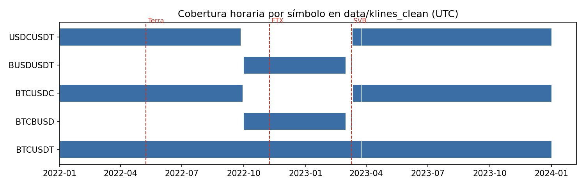

# Propuesta de actualización — Sección 3.4. Control de calidad de los datos

**Autor de la propuesta:** Adriel Zumaeta Calderón (Calidad y documentación)
**Base:** versión actual de la sección 3.4 del informe y resultados de `aportes/adriel/verificar_calidad.py` (ver `reporte_verificacion.md`).

## Qué cambia respecto de la versión actual

| # | Cambio | Motivo |
|---|---|---|
| 1 | Se agrega una subsección de **verificación independiente** de la zona procesada, con tabla de doce chequeos | Hoy la sección solo reporta las reglas que aplica `src/quality.py`; no hay una segunda comprobación sobre la salida |
| 2 | El hueco del 24-mar-2023 deja de ser una hipótesis abierta y se sustenta con evidencia | La vela de las 12:00 UTC cierra a las 12:39 en los tres pares, lo que confirma una interrupción en la fuente |
| 3 | Se precisan las horas **sin ninguna serie de paridad** (348 horas) | El texto actual describe los huecos por símbolo, pero no cuántas horas quedan sin USDCUSDT ni proxy a la vez |
| 4 | Se declaran dos hallazgos nuevos: particiones desplazadas 5 h y una mecha aislada en USDCUSDT | No alteran los datos, pero deben quedar documentados |
| 5 | Se corrige la fecha del límite de los sustitutos: del **1 al 9 de marzo de 2023** | "Entre el 28 de febrero y el 10 de marzo" puede leerse como si incluyera esos dos días, que sí tienen datos |

Los párrafos sobre aggTrades de la versión actual no cambian; se mantienen al final de la sección tal como están.

---

## Texto propuesto

### 3.4. Control de calidad de los datos

El control de calidad se apoya en un conjunto de reglas ejecutadas sobre los 51 919 registros consolidados de los cinco símbolos, y constituye la evidencia de veracidad exigida para el pipeline. La primera regla verifica unicidad por combinación de símbolo y marca de tiempo, y su resultado es cero registros duplicados sobre el total procesado. La segunda regla valida rango y coherencia interna de precios, exigiendo que open, high, low y close se mantengan en valores positivos y que high sea el máximo y low el mínimo de cada intervalo, y su resultado es cero registros rechazados, con una completitud del cien por ciento en los cinco campos críticos de precio y volumen. La tercera regla evalúa continuidad temporal sobre la frecuencia horaria esperada y detecta siete huecos, ninguno de ellos producto de un error de ingesta.

De los siete huecos, cuatro corresponden a la ventana de septiembre de 2022 a marzo de 2023. Dos son el vacío de USDCUSDT y BTCUSDC por la suspensión de esos pares en Binance, de 3 995 y 3 939 horas respectivamente, cubierto en parte mediante los pares sustitutos BUSDUSDT y BTCBUSD. Los otros dos son el límite de cobertura de esos mismos sustitutos, de 216 horas cada uno, del 1 al 9 de marzo de 2023, ambos días incluidos. Los cuatro quedan documentados como ausencia de mercado y no como dato faltante a corregir. Los tres restantes corresponden a una sola vela horaria faltante, la de las 13:00 UTC del 24 de marzo de 2023, ausente de forma simultánea en USDCUSDT, BTCUSDC y BTCUSDT. La vela anterior, la de las 12:00 UTC, cierra a las 12:39 en los tres pares en lugar de a las 12:59, de modo que la interrupción se produjo en la fuente, a mitad de esa hora, y no en el pipeline propio. Todas las marcas de tiempo del control se expresan en UTC.

Al combinar la serie de paridad original con su sustituto, quedan 348 horas sin ningún precio de paridad disponible (Tabla N). La más relevante para el análisis es la mañana del 11 de marzo de 2023, de 00:00 a 13:00 UTC: el sustituto BUSDUSDT termina el 10 de marzo y USDCUSDT recién vuelve a cotizar a las 14:00 del 11. Esas horas coinciden con el inicio del depeg de USDC tras la quiebra de SVB, por lo que el mínimo de 0.882 registrado a las 14:00 es el primer valor observado del evento, no necesariamente su punto más bajo. Esta cobertura parcial se declara como limitación de la evaluación sobre SVB.

**Tabla N**

*Horas sin precio de paridad disponible (ni USDCUSDT ni BUSDUSDT\_proxy).*

| Desde (UTC) | Hasta (UTC) | Horas | Causa |
| ----- | ----- | ----- | ----- |
| 2022-09-26 03:00 | 2022-09-30 23:00 | 117 | Fin de USDCUSDT antes del inicio del sustituto |
| 2023-03-01 00:00 | 2023-03-09 23:00 | 216 | Límite de cobertura del sustituto |
| 2023-03-11 00:00 | 2023-03-11 13:00 | 14 | Ni sustituto ni USDCUSDT |
| 2023-03-24 13:00 | 2023-03-24 13:00 | 1 | Interrupción de la fuente |
| **Total** | | **348** | |

*Nota.* Elaboración propia a partir de data/klines\_clean.

El resultado agregado de las tres reglas confirma que el conjunto final conserva sus 51 919 registros de entrada, sin pérdidas por limpieza y sin registros de calidad dudosa introducidos por el propio procesamiento, lo que deja la veracidad del dato sostenida en la fuente y no en una corrección posterior forzada.

#### Verificación independiente de la zona procesada

Para no depender únicamente del mismo código que limpia los datos, la salida de la zona procesada se verificó por segunda vez con un script independiente en pandas (aportes/adriel/verificar_calidad.py), que lee directamente los archivos Parquet particionados y no reutiliza ninguna función de src/quality.py. Además de repetir las reglas anteriores, agrega controles que el job de Spark no aplica: duración exacta de cada vela, alineación a la hora, consistencia entre la marca de época y la marca UTC, correspondencia entre la partición y la fecha, etiqueta de procedencia del sustituto y rango plausible de precio para las stablecoins. La Tabla N+1 resume el resultado.

**Tabla N+1**

*Resultado de la verificación independiente sobre los 51 919 registros de klines\_clean.*

| Chequeo | Registros que fallan | Estado |
| ----- | ----- | ----- |
| Esquema: columnas y tipos | 0 | Conforme |
| Nulos en columnas obligatorias | 0 | Conforme |
| Duplicados por símbolo y open\_time | 0 | Conforme |
| Coherencia OHLC | 0 | Conforme |
| Volúmenes y número de operaciones no negativos | 0 | Conforme |
| Volumen comprador ≤ volumen total | 0 | Conforme |
| Duración de la vela de 1 hora | 3 | Explicado (interrupción del 24-mar-2023) |
| open\_time alineado a la hora exacta | 0 | Conforme |
| open\_time\_ts coincide con open\_time en UTC | 0 | Conforme |
| Partición año/mes coincide con la fecha UTC | 350 | Hallazgo (ver abajo) |
| fuente\_paridad correcta por símbolo | 0 | Conforme |
| Precio de stablecoins entre 0.80 y 1.20 | 1 | Hallazgo (ver abajo) |

*Nota.* Elaboración propia. Resultados reproducibles con `python aportes/adriel/verificar_calidad.py`.

La verificación deja dos hallazgos que no alteran los valores de los datos, pero que quedan registrados. El primero es que, en 350 registros, la partición año/mes no coincide con la fecha UTC: las cinco primeras horas de cada mes, de 00:00 a 04:00 UTC, quedaron guardadas en la partición del mes anterior. El desfase de cinco horas corresponde a la hora de Perú (UTC−5), con la que la sesión de Spark calculó el año y el mes al escribir la tabla. Las marcas de tiempo de cada registro son correctas, por lo que el EDA y el modelo, que trabajan sobre open\_time\_ts, no se ven afectados; solo una consulta que filtre por partición perdería esas cinco horas. La corrección consiste en fijar spark.sql.session.timeZone en UTC dentro del job de calidad y regenerar la tabla.

El segundo es una vela de USDCUSDT, la de las 20:00 UTC del 11 de mayo de 2022, en plena crisis de Terra/UST, con un máximo de 3.99 mientras la apertura y el cierre se mantienen en 1.003 y 1.005. Se trata de una mecha aislada y no de un cambio de nivel del precio. Se conserva porque es dato real de la fuente, y no afecta al modelo, cuyas variables se calculan sobre el precio de cierre.

La Figura N muestra la cobertura horaria de cada símbolo y la posición de los tres eventos.

**Figura N**

*Cobertura horaria por símbolo en la zona procesada.*

*Nota.* Elaboración propia. Cada barra representa un tramo continuo de velas horarias; las líneas discontinuas marcan el inicio de los eventos de Terra, FTX y SVB.

*(A continuación se mantienen sin cambios los párrafos actuales sobre las cinco reglas de aggTrades, la verificación SHA-256 y la validación cruzada con los klines.)*
